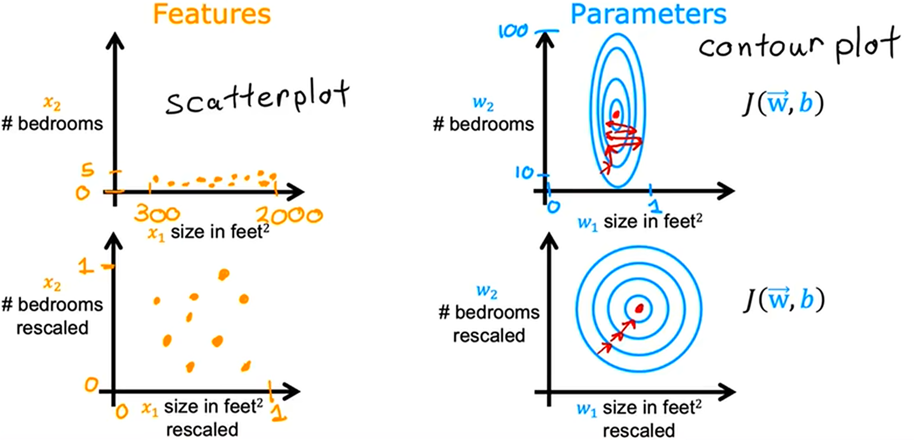
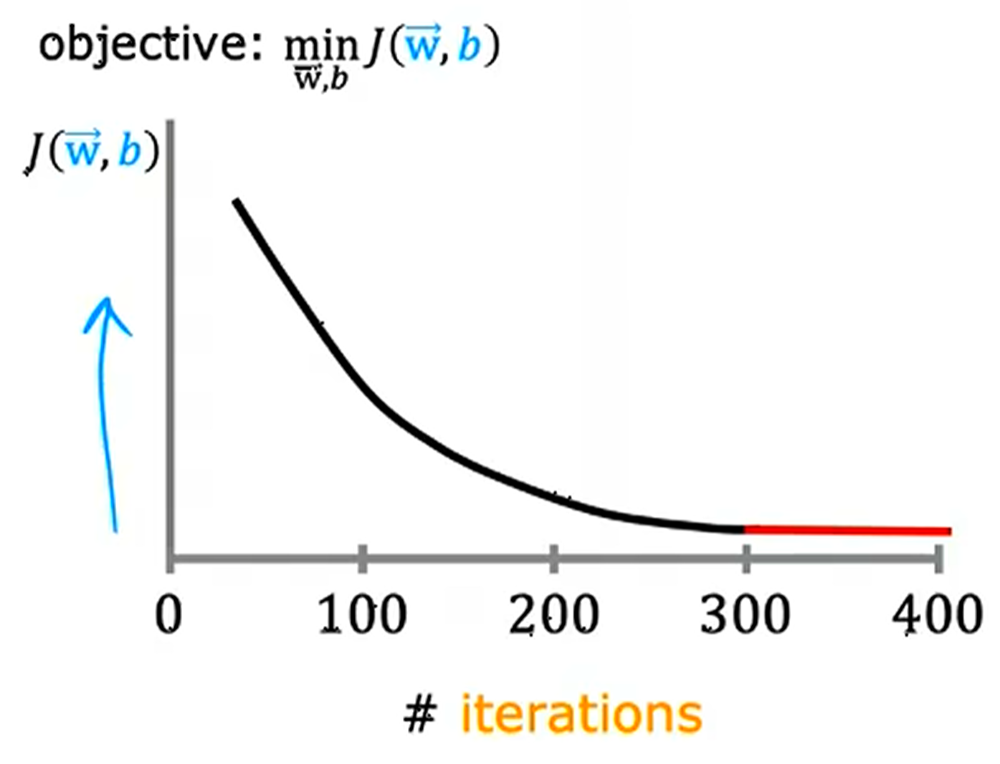
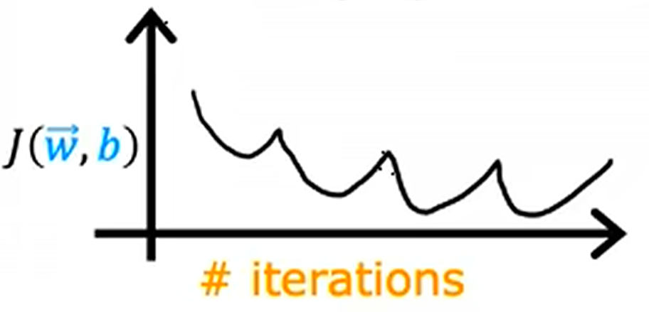
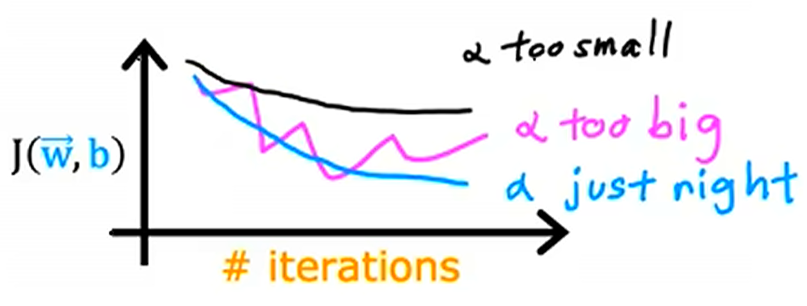

**回归** 是机器学习的一类，用于探索 **连续** 的自然．
**线性假设** 是预测自然的最简单的方式，是最天真烂漫的方式，但也是最基本的方式．
因此 **线性回归** 是机器学习的基础，而后的非线性假设相应的非线性回归也是线性回归的延申．

<!-- more -->

带着问题阅读：

1. 为什么要先研究线性？（多项式回归，特征工程，特征缩放）
2. 为什么不直接使用线性代数的方法，直接得到回归直线？（时间复杂度，泛用性

   $$
   \begin{align*} X\theta &= y \\ X^\text{T}X\theta&=X^\text{T}y \\ \theta &= (X^\text{T}X)^{-1}X^\text{T} y\end{align*}
   $$

3. 学习率越大越好？越小越好？如何选择学习率？（收敛、速度）
4. 为什么要特征工程？（特征的内在联系）
5. 为什么要特征缩放？（梯度下降、量纲、绝对误差）

## 损失函数

现有含 $m$ 个样本的训练集 $(x^{(i)}, y^{(i)})$，其中 $\dim \mathcal X = 1$，$\mathcal Y = \mathbf{R}$．我们试图寻找一个线性函数进行回归：即让机器习得模型 $f:\mathcal X \rightarrow \mathcal Y$，其中

$$
\hat{y} = f_{w, b}(x) = wx+b
$$

而这个模型能够很好地贴合训练集，即对于每个样本，残差的绝对值 $|\hat{y}^{(i)} - y^{(i)}|$ 尽可能地小．

为了描述当前训练的模型 (函数) 与训练集的贴合程度，我们需要定义一种指标：(线性模型的) **代价函数 (cost function)** (也称成本函数，或 **损失函数 (loss function)**)

$$
J(w, b) = \frac{1}{2m}\sum_{i=1}^{m}(\hat{y}^{(i)} - y^{(i)})^2 = \frac{1}{2m}\sum_{i=1}^{m}(f(x^{(i)}) - y^{(i)})^2
$$

它类似于统计学中方差的概念，但分母多了个 $2$，这是由于后续对 $J$ 求偏导时，能够和对平方求导产生的 $2$ 抵消，使结果的形式更好看，并不影响它具有方差的功能．

> 损失函数为什么要定义成这种形式？在概率统计的视角下，这种形式是必然的，详见 [(ML-1-4) 广义线性模型]

> 对于多元线性回归模型，含 $m$ 个样本，$n$ 个特征的训练集 $(\mathbf{x}^{(i)}, y^{(i)})$ 即 $(X, y)$，损失函数是标量场
>
> $$
> \begin{align*}J_{\theta}&= \frac{1}{2m}\sum_{i=1}^{m}(\theta_{0}+\theta_{1} x_{1}^{(i)} + \cdots + \theta_{n}x_{n}^{(i)} - y^{(i)})^2\\&= \frac{1}{2m}\left\| \begin{bmatrix}1 & x_{1}^{(1)} & \cdots & x_{n}^{(1)} \\ 1 & x_{1}^{(2)} & \cdots & x_{n}^{(2)} \\ \vdots & \vdots & \ddots & \vdots \\ 1 & x_{1}^{(m)} & \cdots & x_{n}^{(m)}\end{bmatrix} \begin{bmatrix} \theta_{0} \\ \theta_{1} \\ \vdots \\ \theta_{n} \end{bmatrix}-\begin{bmatrix}y^{(1)} \\ y^{(2)} \\ \vdots \\ y^{(m)}\end{bmatrix}\right\|^2\\&= \frac{1}{2m}\|X \theta - y\|^2\end{align*}
> $$

对于一元线性回归模型，损失函数是关于模型参数 $w, b$ 的二元函数

$$
J(w, b) = \frac{1}{2m}\sum_{i=1}^{m}(f_{w,b}(x^{(i)}) - y^{(i)})^2 = \frac{1}{2m}\sum_{i=1}^{m}(w\hat{x}^{(i)} + b - y^{(i)})^2
$$

它描述了一条直线拟合数据点的程度．

> 可以看出，在一元线性回归模型中，损失函数的图像必然是开口朝上的抛物面，这意味着在后面的梯度下降法中，无论 $w, b$ 取何种初值，最后都能收敛到最小值点．

## 梯度下降法

容易看出，损失函数在最小值点 $(w_{1}', w_{2}', \cdots, b')$ 处取最小值，此时模型整体最贴近所有数据点．

因为*线性*回归模型的损失函数 $J$ 对每个参数都是*二次函数*，我们甚至可以直接解出最小值点．不过为了能获得任何模型损失函数的最小值，我们需要更通用的方法：**梯度下降法 (gradient descent)**．

根据多元函数微积分的知识，损失函数的梯度(向量)

$$
\nabla_{w_{1}, w_{2}, \cdots, b} \,J
$$

反映了损失函数增长最快的方向，其反方向便是损失函数值下降最快的方向．因此我们在某个初始点开始，一直沿着损失函数值下降最快的方向走，只要步长合理，理论上就能到达极小值点，甚至最小值点．

> $w, b$ 的初值就是起点，不同的起点，下山到达的极小值点也不同．

不妨设这个过程中步长不变，即 **学习率** $\alpha$ 为正常数，那么上述过程就可以表示为

$$
\Delta (w_{1}, w_{2}, \cdots, b) = - \alpha \nabla J(w_{1}, w_{2}, \cdots, b)
$$

即

$$
\Delta \theta = -\alpha \nabla_{\theta} \,J(\theta)
$$

> 可以单独拎出一个参数 $w$ 来看，上式化为
>
> $$
> \Delta w = -\alpha \cdot \frac{\mathrm{d}}{\mathrm{d}w}J(w)
> $$
>
> 在导数绝对值大的时候，步长 $\Delta w$ 的绝对值也大，反之同理．这意味着即使我们的学习率固定不变，梯度下降法依旧能合理决定步长．
>
> 学习率较小时，迈的步子也较小，更容易收敛于离起点最近的极小值点．如果最小值点就在起点附近，这是件好事，但更多情况下，这件好事并不会送上门来．学习率小意味着*保守*，独囿于窝边草，最后收敛点处的函数极小值并不小．
>
> 学习率较大时，迈的步子也较大，更倾向于寻找全局最小值点．学习率大意味着*激进*，虽更有可能找到最小值点，但也更容易浮躁：学习率过大会导致点列发散，无法收敛于某一极小值点．
>
> 综上，学习率的大小对模型的训练效果起到关键的作用．

根据链式法则，对于一元线性回归模型，

$$
\begin{align*} \frac{\partial}{\partial w}J(w, b) &= \frac{\partial}{\partial w} \frac{1}{2m}\sum_{i=1}^{m} (f_{w,b}(x^{(i)}) - y^{(i)})^2 \\ &= \frac{1}{m}\sum_{i=1}^{m} (f_{w,b}(x^{(i)}) - y^{(i)}) \frac{\partial}{\partial w}( wx^{(i)}+b - y^{(i)}) \\ &= \frac{1}{m}\sum_{i=1}^{m} (f_{w,b}(x^{(i)}) - y^{(i)})x^{(i)} \\ \frac{\partial}{\partial b}J(w, b) &= \frac{\partial}{\partial b} \frac{1}{2m}\sum_{i=1}^{m} (f_{w,b}(x^{(i)}) - y^{(i)})^2 \\ &= \frac{1}{m}\sum_{i=1}^{m} (f_{w,b}(x^{(i)}) - y^{(i)}) \frac{\partial}{\partial b}( wx^{(i)}+b - y^{(i)}) \\ &= \frac{1}{m}\sum_{i=1}^{m}(f_{w,b}(x^{(i)}) - y^{(i)})\end{align*}
$$

于是我们就可以根据当前的 $w, b$ ，结合所有数据点 $(x^{(i)}, y^{(i)})$，算出 $\frac{\partial}{\partial w}J(w, b), \frac{\partial}{\partial b}J(w, b)$，即梯度 $\nabla J(w, b)$，进而结合 $\alpha$ 算出步进 $\Delta w$ 和 $\Delta b$，实时更新 $w \leftarrow w + \Delta w$，$b \leftarrow b + \Delta b$．

> 在多元线性回归模型中，损失函数梯度
>
> $$
> \begin{align*}\nabla_{\theta}\,J &= \frac{\partial}{\partial \theta}\frac{1}{2m}\|X \theta - y\|^2 \\ &= \frac{1}{2m}\frac{\partial}{\partial \theta}(X\theta - y)^\text{T}(X\theta-y) \\ &= \frac{1}{m}\left[ \frac{\partial}{\partial \theta}(X\theta - y) \right](X\theta-y)\\ &= \frac{1}{m}X^\text{T}(X\theta - y)\end{align*}
> $$
>
> 步进
>
> $$
> \Delta \theta = -\alpha \nabla_{\theta}\,J= -\frac{\alpha}{m}X^\text{T}(X\theta - y)
> $$
>
> 可能用到的矩阵微积分公式详见 [(ML-0) 微积分与线性代数]

## 一些优化

### 特征缩放

特征量纲、单位的不同会导致不同特征的绝对值相去甚远，这会降低梯度下降的效率：

因此我们需要预先对数据进行 **归一化 (Normalization)** 或 **标准化(Standardization)** 操作，以消除一定这样的影响．

#### 均值归一化

对一组数据 $x$ 进行均值归一化 $$x' = \frac{x-\mu}{x_{\text{max}} - x_{\text{min}}}$$ 后，数据均值落在原点，范围被限制在 $[-1, 1]$ 之间，且量纲被消除．

> 归一化容易受到极端值影响，导致归一化后数据整体远离原点．
> 归一化并没有很好的保留数据间的距离信息．
> 归一化适用于不涉及距离度量、协方差计算、不服从正态分布的情况．

#### Z-score 标准化

Z-score 标准化 $$x' = \frac{x-\mu}{\sigma}$$ 同样实现了均值变为 $0$ 且消除量纲的效果，但不是限制数据整体范围，而是将标准差变为 $1$，从而较好地保留了数据之间的分布，实现了数据分布的归一化，同时一定程度上保留了数据之间的距离信息．

> 标准化后的数据分布范围可能为 $(-\infty, \infty)$．
> 标准化丢失了权值．
> Z-score 标准化广泛应用于机器学习算法中，如支持向量机、逻辑回归和类神经网络．

### 特征工程

在现实中，数据特征的选取不局限于表层的物理量，还可以通过已有特征*转化、合成*得到．

> 例如欲通过房子长和宽预测房价，运用线性回归模型
>
> $$
> f_{\mathbf{w}, b}(\mathbf{x}) = w_{1}x_{1}+w_{2}x_{2}+b
> $$
>
> 来进行训练．不过为了得到更好的模型，我们可以在已有特征 $x_{1}, x_{2}$ 的基础上，构造出新的特征：占地面积 $x_{3} = x_{1}x_{2}$，此时新的线性回归模型是
>
> $$
> f_{\mathbf{w}, b}(\mathbf{x}) = w_{1}x_{1}+w_{2}x_{2}+w_{3}x_{3} + b
> $$
>
> 我们用这个模型去训练．*这样训练会让机器在学习过程中更有可能注意到 $x_{3}$ 和 $x_{1}, x_{2}$ 的内在联系，更有可能领悟到 $x_{1},x_{2}$ 相对于 $x_{3}$ 是“长度”这一抽象概念*．

### 多项式回归

实际上多项式回归可以看成特征工程的一个应用：在某个特征 $x_{i}$ 的基础上添加新的特征 $x_{i}^2, x_{i}^3,\cdots$
后，再进行线性回归即可．

### 学习曲线与学习率的选取

我们想要知道模型训练进程情况，可以通过梯度下降过程中每次参数迭代后的损失函数的值得知．具体地说，我们可以作出”迭代次数-损失函数值“的图像而得知训练情况．

正常情况下，模型的有效训练要求*学习曲线必须收敛*，而且*最好单调递减*，因为我们的梯度下降是要找到损失函数的极小值点，而不是在山上时上时下不下山．

我们可以规定一个临界值 $\varepsilon > 0$，当 $- \Delta J < \varepsilon$ 时，停止训练．

> 学习曲线如果在收敛过程中，时有回升，这通常说明学习率过大，迭代点不容易落在坑里，此时需要适当降低学习率以确保收敛．
> 
> 
> *只要学习率足够小，学习曲线必收敛*．因为迈的步子小必然落在最近的坑里．这个特性也可以用来测试训练代码是否正确．当然，学习率小也意味着训练速度低，学习曲线收敛慢．
