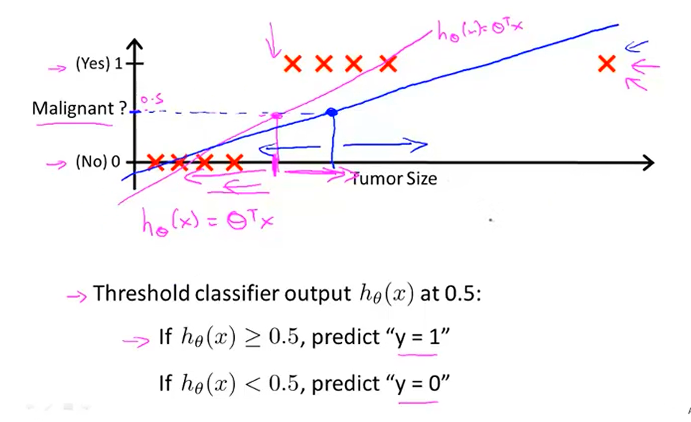
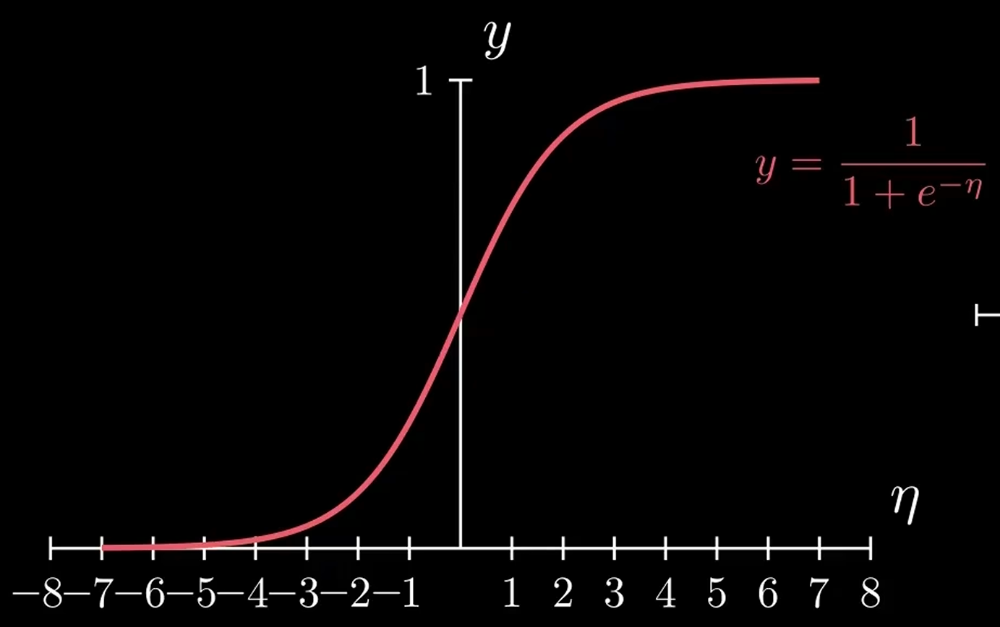
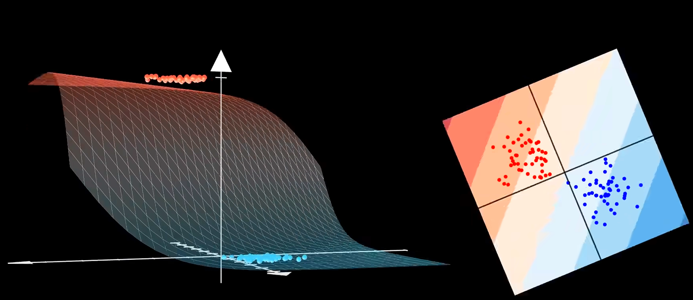
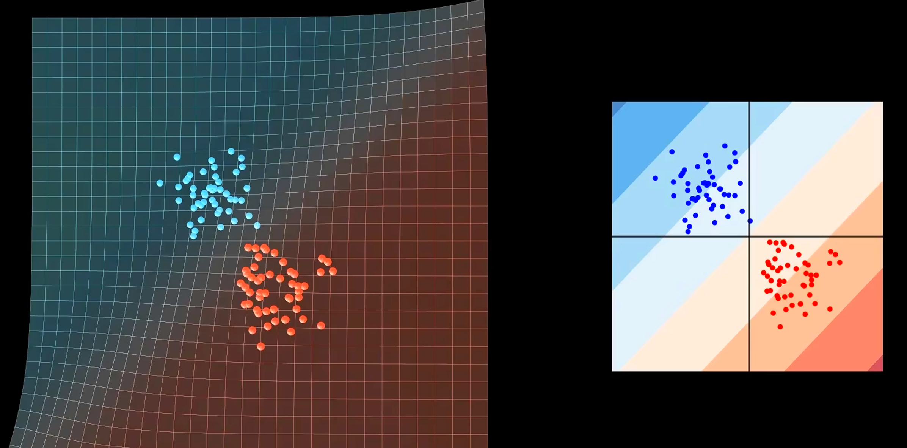
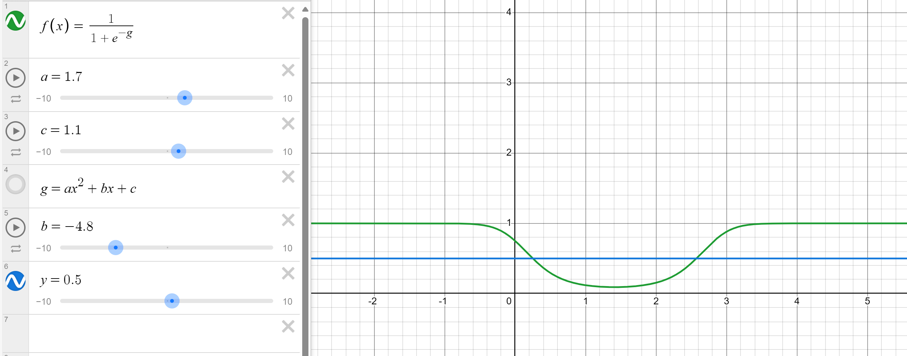
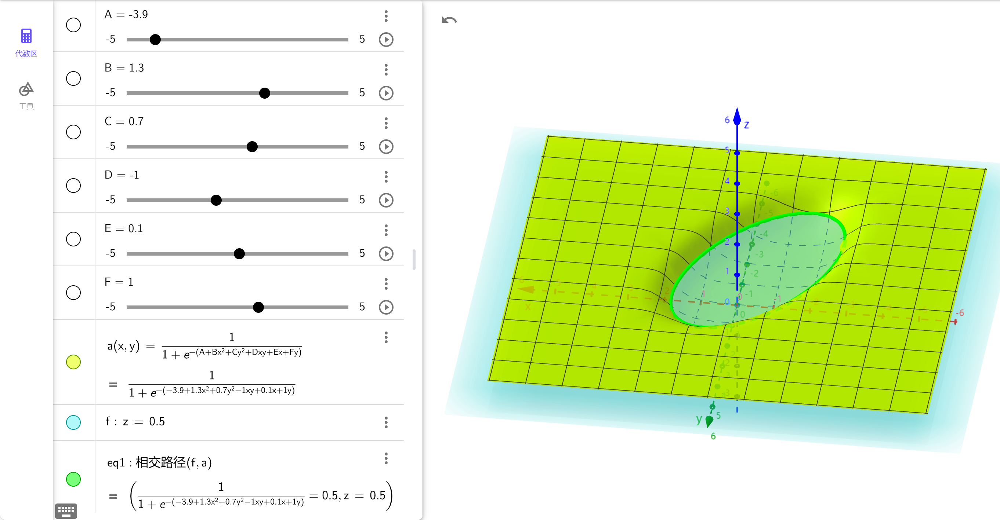

**分类** 也是机器学习的一类，用于探索 **离散** 的自然．
**逻辑回归** 名字带着回归，实际上用于分类，它是线性回归的延申，只不过把回归的值域映射到了离散集．

<!-- more -->

## 从线性回归到逻辑回归

对于数据中的每个数据点 $(x_{1}^{(i)}, x_{2}^{(i)}, y^{(i)})$，都有 $y^{(i)} \in \{0, 1\}$．试将这些点 $(x_{1}^{(i)}, x_{2}^{(i)})$ 分为两类，被标记为 $0$ 的一类和被标记为 $1$ 的一类．

我们当然可以继续使用线性回归：用平面拟合这些点，以高度为 $0.5$ 的直线为界分类．

> 但此时线性回归的输出是连续的 $\mathbf{R}$，标记空间是离散的 $\{0, 1\}$，这会造成麻烦：当出现极端数据时，用于拟合的平面根本没法做到很好的拟合．
> 

这意味着我们需要一种 **映射**，先将线性回归输出的 $\mathbf{R}$ 映射到 $\{0, 1\}$，得到复合函数，再用这个函数去拟合．

> 我们很容易想到进行人为的 **阶跃函数** 去映射：平面高度大于 $0.5$ 的区域的函数值视作 $1$，不足 $0.5$ 的区域视作 $0$，但这种阶跃函数并不连续，没有优良的数学性质．

阶跃函数的光滑版便是 **sigmoid 函数**

$$
\text{sigmoid}\,t = S(t) = \frac{1}{1+e^{-t}}
$$

它单调递增，在正负无穷远处分别趋于 $1$ 和 $0$，且当 $t = 0$ 时，$S(t) = 0.5$．

这个时候我们用于拟合的函数从 $y = x^\text{T}\theta$ 变成了

$$
y = \text{sigmoid}(x^\text{T}\theta) = \frac{1}{1+e^{-x^\text{T}\theta}}
$$

截取 sigmoid 函数 $y = 0.5$ 的部分 (也就是令 sigmoid 函数的自变量 $x^\text{T}\theta = 0$ 得到的红蓝边界直线) ，其在特征空间的投影就是 **决策边界**．决策边界将特征空间分成两个部分，对应于分类任务的正类和负类．离决策边界越近的样本点，分类判断越容易改变．离决策边界越远的样本点，分类判断越明确．特征空间中的每个点对应的 sigmoid 函数值可以视作该点对应的预测值 $y$ 为 $1$ 的概率．

当然，$x^\text{T}\theta$ 不一定是线性函数，还可以是多项式函数（特征工程），这样我们就能进行更复杂的二分类任务：

> 用来拟合的曲线暂时选好了，那怎么评价拟合效果呢？显然损失函数不能长得像最小二乘估计了，因为几何上“距离”的概念被映射扭曲掉了．

**损失函数的定义来自极大似然估计**，表达式为

$$
J(\theta) = \frac{1}{m}\sum_{i=1}^m (- y^{(i)}{\eta^{(i)}} + \ln(1+e^{\eta^{(i)}}))
$$

凸优化理论可以证明这是一个凸函数 (Convex Function) [(ML-0) 微积分与线性代数#凸性分析]，牛顿迭代法、梯度下降法都可以得到最值点．在梯度下降法中，步进

$$
\Delta \theta = -\frac{\alpha}{m} \sum_{i=1}^m \left( -y^{(i)} + \text{sigmoid}\, {\eta^{(i)}} \right)x^{(i)}
$$

> 关于极大似然估计、损失函数表达式证明过程见 [(ML-1-4) 广义线性模型#逻辑回归]

## 从二分类到多分类

目前我们已经实现了二分类任务：根据输入得出分类结果：$0$ 和 $1$，那多分类呢？

> 直接沿用前面的思路，即找到一种映射，将 $\mathbf{R}$ 映射到离散的 $\{0, 1, 2\}$ 是十分困难的，因为这涉及到 $\mathrm{C}_{3}^2 = 3$ 种决策边界．我们更倾向于利用已有的二分类器构造多分类器．

对于三分类任务，一种思路就是构造三种二分类器，用以分别判断是否为 $0$，是否为 $1$，是否为 $2$．我们不会将 $\mathbf{R}$ 真正映射到离散的 $\{0, 1\}$，而是保留其预测的类别概率，最后三个概率取最大者，即为分类结果．这种思路便是 **一对余 (One vs. Rest，OvR)**．

> 除了一对余，还有 **多对多 (Many vs. Many，MvM)** 的思路：多个二分类器将多种类归为正类，其余类为反类，它们的结果根据特定的编码规则（纠错输出码，ECOC），最终得到分类结果．
