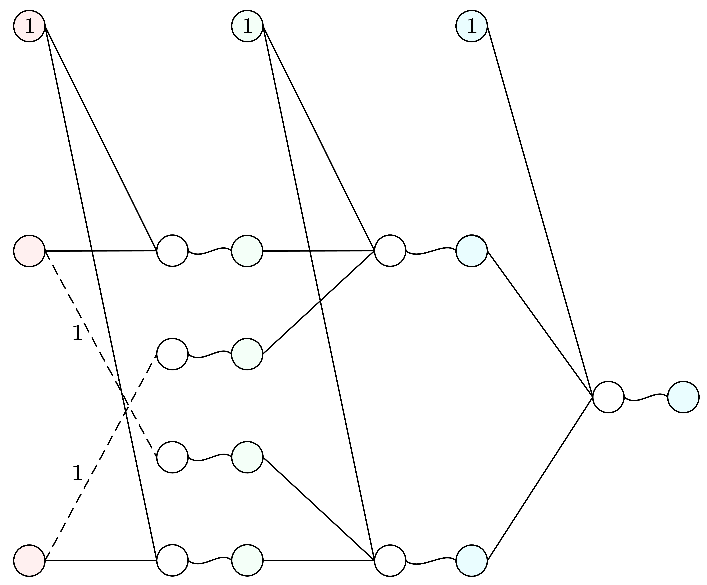

在不基于原有特征上人为构造新特征的前提下，线性模型（只有一层的神经网络）很难解决复杂问题，甚至连给简单交叉的点集分类都手足无措．
**异或问题** 一度成为人工神经网络的梦魇，相关研究停滞了一段时间，直到 20 世纪 70 年代，一种基于 **反向传播算法** 的神经网络模型很好地解决了这一问题．
此后，对人工神经网络的相关研究迅猛发展．

<!-- more -->

## 过往的模型

在这之前，我们学习过的线性回归和逻辑回归，都是建立了从样本空间 $\mathcal{X}$ 到标记空间 $\mathcal{Y}$ 的简单映射，可以被视作 **只有一层** 的神经网络：

但一层的局限性很大，如果不引入额外特征加入训练，很难建立复杂的模型，以解决复杂的问题．

> 事实上，在计算机视觉（CV）中，样本特征就是图片每个像素点，这导致特征数 $O(n)$ 本来就多，若想使用这种简单的模型解决复杂问题，就必须构造新的特征：比如引入 $O(n^2)$ 数量的交叉项 $x_{1}^2, x_{1}x_{2}, \cdots$，并且这样做也收效甚微．有什么办法，在不引入新特征的条件下，提高模型的复杂度？
> 

## 加一层

逻辑电路的设计为我们提供新的思路：如果我们只有与或非 $\land, \lor, \lnot$ 三种门，如何表示所有逻辑函数，比如异或 $\oplus$？

（真值表有四行，对应平面上的四个点）可以证明，单凭两种特征对与或非这三种问题是能够进行简单二分类的（**线性可分**）：

但对异或问题进行简单的二分类（对角的一组点归为一类）是无法将两种输出分开来的（**线性不可分**），因为你无法使用一条直线将这两类交叉的点群分开来．

事实上 $\{\land, \lor, \lnot\}$ 就构成了联结词完备集，通过一定的连接方式，就能够表示所有逻辑函数，比如

$$
a \oplus b = (\lnot\, a \land b) \lor (a \land \lnot\, b)
$$

可以看到，在门种类数有限的情况下，门数和门层数的增加是不可避免的．

我们只用了三种门，就能表示所有的逻辑函数．把这个例子搬到机器学习，道理就是：特征种数有限的情况下，“增加层数”能提高模型的复杂度．

> “增加层数”在图像识别领域里意味着什么？相比直接把每个像素点值一股脑摆在机器面前，让机器立即判断图片的数字是几，“增加层数”意味着解决不同规模的局部问题，汇总局部结果，解决整体问题．
> 

## 多隐层反馈神经网络

把一层的输出结果再作为输入，我们就得到多层的神经网络（偏置项隐去）：

这个神经网络共 $(L + 1)$ 层，分为三类：**输入层、隐藏层、输出层**．输入层 $\mathbf{a}^{(0)}$ 固定．在隐藏层中，每层之间从上一层的激活值 $\mathbf{a}^{(l - 1)}$，线性映射到这一层的未激活值

$$
\mathbf{z}^{(l)} = \mathbf{W}^{(l)}\mathbf{a}^{(l - 1)} + \mathbf{b}^{(l - 1)}
$$

线性映射中的每条边权称为 **权重**．接着这一层的未激活值会被激活成激活值

$$
\mathbf{a}^{(l)} = \sigma(\mathbf{z}^{(l)})
$$

其中 $\sigma(\cdot)$ 是激活函数，常见的有 Sigmoid 函数、Softmax 函数、ReLU 函数、双曲正切函数等．这种把值从前往后传的传播过程称为 **前向传播**．

从输入层 $\mathbf{a}^{(0)}$ 开始，经过不断的前向传播，我们就会得到输出层的结果 $\mathbf{a}^{(L)}$．在输出层，根据标签值，我们就可以得到 **损失函数** 的值

$$
\mathcal L = f(\mathbf{a}^{(L)}, \mathbf{y})
$$

> 在回归任务中，损失函数的值可以是 **均方误差（Mean Squared Error, MSE）**
>
> $$
> \mathcal{L}_\mathrm{MSE}=\frac{1}{2}\|\mathbf{a}^{(L)}-\mathbf{y}\|^2=\frac{1}{2}\sum_{i=1}^{n_L}(a_i^{(L)}-y_i)^2
> $$
>
> 如果要 **正则化**（以 L2 正则化为例，给予高边权值惩罚，防止过拟合），则
>
> $$
> \begin{align*} \mathcal{L}_\mathrm{MSE}&=\frac{1}{2}\|\mathbf{a}^{(L)}-\mathbf{y}\|^2 + \frac{\lambda}{2} \sum_{l = 1}^{L}\sum_{i,j} {W_{ij}^{(l)}}^2 \\ &=\frac{1}{2}\|\mathbf{a}^{(L)}-\mathbf{y}\|^2 + \frac{\lambda}{2} \sum_{l = 1}^{L}\|\mathbf{W}^{(l)}\|^2 \end{align*}
> $$
>
> 在分类任务中，损失函数的值可以是 **交叉熵损失（Cross-Entropy Loss）**
>
> $$
> \mathcal{L}_{\mathrm{CE}}=-\sum_{i=1}^{n_L}y_i\log a_i^{(L)}
> $$
>
> 此时激活函数应为 Softmax 函数
>
> $$
> \mathbf{a}^{(L)}=\mathrm{Softmax}(\mathbf{z}^{(L)})
> $$
>
> 即
>
> $$
> a_i^{(L)}=\frac{e^{z_i^{(L)}}}{e^{z_1^{(L)}} + e^{z_2^{(L)}} + \cdots + e^{z_{n_{L}}^{(L)}}}
> $$

## 反向传播算法

为了最小化损失函数的值，我们沿用 **梯度下降** 的方法：找到损失函数 $\mathcal L$ 关于每个模型参数 $W_{ij}^{(l)}$ 的偏导数 $\frac{\partial \mathcal L}{\partial W}$，找到步进方向．

在之前只有一层的神经网络中，我们能够根据当前输出值 $X\theta$ 、标签值 $y$ 以及上一层的值（输入值）$X$，就能得到损失函数关于当前参数的梯度[(ML-1-2) 线性回归]]

$$
\nabla_{\theta}\,J = \frac{1}{m}X^\text{T}(X\theta - y)
$$

这种处理意味着单层结构中，损失函数关于参数偏导数的求法我们能一步到位，但现在有多层结构，我们要求中间损失函数关于某一层某一条连接的边权的偏导数 $\frac{\partial \mathcal L}{\partial W_{ij}^{(l)}}$，该怎么办？

> 联想到我们在求多元复合函数偏导数的时候，会画出函数的复合结构图，找出从某一自变量出发，到达目标因变量的所有路径，进而根据 **链式法则** 写出偏导表达式．前向传播的过程正是函数复合的过程，这个函数的复合结构图就是我们的神经网络图．

之前我们实现了只有一层的，从输出值和标签值出发的偏导数求法．

对于多层，从目标边权 $W_{ij}^{(l)}$ 出发，找出所有通往输出层 $\mathbf{a}^{(L)}$ 每个节点的路径（因为损失函数 $\mathcal L$ 与 $\mathbf{a}^{(L)}$ 所有元素有关）．

我们从输出层 $L$ 出发，根据之前只有一层的做法，可以得到损失函数 $\mathcal L$ 关于第 $L$ 层激活值 $\mathbf{a}^{(L)}$ 的偏导数 $\frac{\partial \mathcal L}{\partial \mathbf{a}^{(L)}}$，又已知第 $L$ 层当前未激活值 $\mathbf{z}^{(L)}$，我们也能得到第 $L$ 层激活值 $\mathbf{a}^{(L)}$ 关于未激活值 $\mathbf{z}^{(L)}$ 的偏导数 $\frac{\partial \mathbf{a}^{(L)}}{\partial \mathbf{z}^{(L)}}$，于是我们根据链式法则 [(ML-0) 微积分与线性代数] 就能得到

$$
\boldsymbol\delta^{(L)} = \frac{\partial \mathcal L}{\partial \mathbf{z}^{(L)}} = \left( \frac{\partial \mathbf{a}^{(L)}}{\partial \mathbf{z}^{(L)}} \right)^\top \frac{\partial \mathcal L}{\partial \mathbf{a}^{(L)}} = [(\text{diag} \,\sigma')(\mathbf{z}^{(L)})] \frac{\partial \mathcal L}{\partial \mathbf{a}^{(L)}} = \frac{\partial \mathcal L}{\partial \mathbf{a}^{(L)}} \odot \sigma'(\mathbf{z}^{(L)})
$$

（对应元素操作的雅可比矩阵为对角阵，对角阵与向量的相乘退化成两个向量逐元素相乘 $\odot$）它也被称作第 $L$ 层的 **误差项**，这样我们就把第一步给完成了：**输出层的误差计算**．

中间隔了那么多的隐藏层怎么传到目标边权 $W_{ij}^{(l)}$？于是我们开始 **隐藏层之间的误差项的传递**：考虑从第 $(l + 1)$ 层 $\boldsymbol\delta^{(l + 1)}$ 到第 $l$ 层 $\boldsymbol\delta^{(l)}$ 的传递，我们现在有

$$
\begin{align*} \mathbf{z}^{(l + 1)} &= \mathbf{W}^{(l + 1)}\mathbf{a}^{(l)} + \mathbf{b}^{(l)} \\ \mathbf{a}^{(l)} &= \sigma(\mathbf{z}^{(l)})\end{align*}
$$

因此

$$
\begin{align*}\boldsymbol\delta^{(l)} &= \frac{\partial \mathcal L}{\partial \mathbf{z}^{(l)}} = \left( \frac{\partial \mathbf{z}^{(l + 1)}}{\partial \mathbf{z}^{(l)}} \right)^\top \frac{\partial \mathcal L}{\partial \mathbf{z}^{(l + 1)}} = \left( \frac{\partial \mathbf{z}^{(l + 1)}}{\partial \mathbf{a}^{(l)}} \frac{\partial \mathbf{a}^{(l)}}{\partial \mathbf{z}^{(l)}} \right)^\top \frac{\partial \mathcal L}{\partial \mathbf{z}^{(l + 1)}} \\ &= (\mathbf{W}^{(l + 1)} [(\text{diag} \,\sigma')(\mathbf{z}^{(l)})])^\top \boldsymbol\delta^{(l + 1)} = [(\text{diag} \,\sigma')(\mathbf{z}^{(l)})]^\top ({\mathbf{W}^{(l + 1)}}^\top \boldsymbol\delta^{(l + 1)}) \\ &= ({\mathbf{W}^{(l + 1)}}^\top \boldsymbol\delta^{(l + 1)}) \odot \sigma'(\mathbf{z}^{(l)})\end{align*}
$$

一直往回传，误差项传到第 $l$ 层，已经兵临城下了．只剩最后一步：**参数偏导数计算**．

由于目标边权 $W_{ij}^{(l)}$ 只与 $z_{i}^{(l)}$ 有关，而

$$
z_{i}^{(l)} = \sum_{j=1}^{n_{l}} W_{ij}^{(l)}a_{j}^{(l - 1)} + b_{i}^{(l)}
$$

因此

$$
\frac{\partial \mathcal L}{\partial W_{ij}^{(l)}} = \left( \frac{\partial \mathbf{z}^{(l)}}{\partial W_{ij}^{(l)}} \right)^\top \frac{\partial \mathcal L}{\partial \mathbf{z}^{(l)}} = \delta_{i}^{(l)}a_{j}^{(l - 1)}
$$

更一般地，损失函数 $\mathcal L$ 关于第 $l$ 层所有边权 $\mathbf{W}^{(l)}$ 的偏导数

$$
\frac{\partial \mathcal L}{\partial \mathbf{W}^{(l)}} = \boldsymbol\delta^{(l)}{\mathbf{a}^{(l - 1)}}^\top
$$

损失函数 $\mathcal L$ 关于第 $l$ 层偏置项 $\mathbf{b}^{(l)}$ 的偏导数

$$
\frac{\partial \mathcal L}{\partial \mathbf{b}^{(l)}} = \left( \frac{\partial \mathbf{z}^{(l)}}{\partial \mathbf{b}^{(l)}} \right)^\top \frac{\partial \mathcal L}{\partial \mathbf{z}^{(l)}} = I^\top \boldsymbol\delta^{(l)} = \boldsymbol\delta^{(l)}
$$

> 如果实施 L2 正则化，则修正梯度
>
> $$\frac{\partial \mathcal L}{\partial \mathbf{W}^{(l)}} = \boldsymbol\delta^{(l)}{\mathbf{a}^{(l - 1)}}^\top + \lambda \mathbf{W}^{(l)}
> $$

总的来看，

$$
\begin{align*} \boldsymbol\delta^{(L)} &= \frac{\partial \mathcal L}{\partial \mathbf{a}^{(L)}} \odot \sigma'(\mathbf{z}^{(L)}) \\ \boldsymbol\delta^{(L - 1)} &= ({\mathbf{W}^{(L)}}^\top \boldsymbol\delta^{(L)}) \odot \sigma'(\mathbf{z}^{(L - 1)}) \\ &\:\,\,\vdots \\ \boldsymbol\delta^{(l + 1)} &= ({\mathbf{W}^{(l + 2)}}^\top \boldsymbol\delta^{(l + 2)}) \odot \sigma'(\mathbf{z}^{(l + 1)}) \\ \boldsymbol\delta^{(l)} &=({\mathbf{W}^{(l + 1)}}^\top \boldsymbol\delta^{(l + 1)}) \odot \sigma'(\mathbf{z}^{(l)}) \\ \frac{\partial \mathcal L}{\partial \mathbf{W}^{(l)}} &= \boldsymbol\delta^{(l)}{\mathbf{a}^{(l - 1)}}^\top\end{align*}
$$

这个误差项往回传的过程我们称为 **反向传播（BP, Back Propagation）**．

> 对于 **MSE + Sigmoid**，
>
> $$
> \frac{\partial \mathcal L}{\partial \mathbf{a}^{(L)}} = \frac{\partial}{\partial \mathbf{a}^{(L)}}\frac{1}{2}\|\mathbf{a}^{(L)}-\mathbf{y}\|^2 = I^\top (\mathbf{a}^{(L)}-\mathbf{y}) = \mathbf{a}^{(L)}-\mathbf{y}
> $$
>
> 且
>
> $$
> \sigma'(\cdot) = \sigma(\cdot)(1-\sigma(\cdot))
> $$

## 批量训练

因此，对于含 $m$ 个样本的训练集 $\{(\mathbf{a}^{(0)}, \mathbf{y})\}$，我们的训练步骤如下：

1. 初始化网络边权 $\mathbf{W}^{(l)} \gets \mathbf{O}$，$\mathbf{b}^{(l)} \gets \mathbf{0}$；
2. 每次迭代：
   1. 初始化 $\mathcal L \gets 0$，遍历训练集所有样本，当遍历到样本 $(\mathbf{a}^{(0)}, \mathbf{y})$ 时，
      1. 前向传播：$\mathbf{z}^{(l)} \gets \mathbf{W}^{(l)}\mathbf{a}^{(l - 1)} + \mathbf{b}^{(l)}$，$\mathbf{a}^{(l)} \gets \sigma(\mathbf{z}^{(l)})$；
      2. 累计损失函数：$\mathcal L \gets \mathcal L + \frac{1}{2m} \|\mathbf{a}^{(L)} - \mathbf{y}\|^2$；
   2. 添加正则项：$\mathcal L \gets \mathcal L + \frac{\lambda}{2}  \sum_{l} {\|\mathbf{W}^{(l)}\|}^2$；
   3. 反向传播：
      1. 输出层误差：$\boldsymbol\delta^{(L)} \gets \frac{\partial \mathcal L}{\partial \mathbf{a}^{(L)}} \odot \sigma'(\mathbf{z}^{(L)})$；
      2. 隐层传播到第一层：初始化 $\frac{\partial \mathcal L}{\partial \mathbf{W}^{(l)}} \gets \mathbf{O}$，$\frac{\partial \mathcal L}{\partial \mathbf{b}^{(l)}} \gets \mathbf{0}$，到第 $l$ 层时，
         1. 误差：$\boldsymbol\delta^{(l)} \gets ({\mathbf{W}^{(l + 1)}}^\top \boldsymbol\delta^{(l + 1)}) \odot \sigma'(\mathbf{z}^{(l)})$；
         2. 梯度累计：$\frac{\partial \mathcal L}{\partial \mathbf{W}^{(l)}} \gets \frac{\partial \mathcal L}{\partial \mathbf{W}^{(l)}} + \frac{1}{m}\boldsymbol\delta^{(l)}{\mathbf{a}^{(l - 1)}}^\top$，$\frac{\partial \mathcal L}{\partial \mathbf{b}^{(l)}} \gets \frac{\partial \mathcal L}{\partial \mathbf{b}^{(l)}} + \frac{1}{m}\boldsymbol\delta^{(l)}$；
         3. 添加正则项：$\frac{\partial \mathcal L}{\partial \mathbf{W}^{(l)}} \gets \frac{\partial \mathcal L}{\partial \mathbf{W}^{(l)}} + \lambda \mathbf{W}^{(l)}$；
         4. 更新：$\mathbf{W}^{(l)} \gets \mathbf{W}^{(l)} - \alpha \frac{\partial \mathcal L}{\partial \mathbf{W}^{(l)}}$，$\mathbf{b}^{(l)} \gets \mathbf{b}^{(l)} - \alpha \frac{\partial \mathcal L}{\partial \mathbf{b}^{(l)}}$．

我们也可以不显式遍历样本，把训练集里的所有样本合并成矩阵 $\mathbf{A}^{(0)}$ 和 $\mathbf{Y}$，整体进行传播，此时两个矩阵的形状是 $\mathbf{A}^{(0)} \in \mathbb{R}^{n_{0} \times m}$，$\mathbf{Y} \in \mathbb{R}^{n_{L} \times m}$，$\mathbf{A}$ 的每一列都是一个样本：

1. 初始化网络边权 $\mathbf{W}^{(l)} \gets \mathbf{O}$，$\mathbf{b}^{(l)} \gets \mathbf{0}$；
2. 每次迭代：
   1. 前向传播：$\mathbf{Z}^{(l)} = \mathbf{W}^{(l)}\mathbf{A}^{(l - 1)} + \mathbf{b}^{(l)}$，$\mathbf{A}^{(l)} = \sigma(\mathbf{Z}^{(l)})$；（利用广播机制实现矩阵与向量相加，此时 $\mathbf{b}^{(l)}$ 沿列的方向（横向复制）被拓展成 $\mathbf{B}^{(l)} \in \mathbb{R}^{n_{l} \times m}$）
   2. 损失函数：$\mathcal L \gets \frac{1}{2m} \|\mathbf{A}^{(L)} - \mathbf{Y}\|^2 + \frac{\lambda}{2}  \sum_{l} {\|\mathbf{W}^{(l)}\|}^2$；
   3. 反向传播：
      1. 输出层误差：$\boldsymbol\Delta^{(L)} \gets \frac{\partial \mathcal L}{\partial \mathbf{A}^{(L)}} \odot \sigma'(\mathbf{Z}^{(L)})$；
      2. 隐层传播到第一层：到第 $l$ 层时，
         1. 误差：$\boldsymbol\Delta^{(l)} \gets ({\mathbf{W}^{(l + 1)}}^\top \boldsymbol\Delta^{(l + 1)}) \odot \sigma'(\mathbf{Z}^{(l)})$；
         2. 梯度：$\frac{\partial \mathcal L}{\partial \mathbf{W}^{(l)}} = \frac{1}{m}\boldsymbol\Delta^{(l)}{\mathbf{A}^{(l - 1)}}^\top + \lambda\mathbf{W}^{(l)}$，$\frac{\partial \mathcal L}{\partial \mathbf{b}^{(l)}} = \frac{1}{m}\mathbf{\Delta}^{(l)}\mathbf{1}_{m}$，其中 $\mathbf{1}_{m}$ 为全 1 向量，用于对 $\mathbf{\Delta}^{(l)}$ 横向取平均值；
         3. 更新：$\mathbf{W}^{(l)} \gets \mathbf{W}^{(l)} - \alpha \frac{\partial \mathcal L}{\partial \mathbf{W}^{(l)}}$，$\mathbf{b}^{(l)} \gets \mathbf{b}^{(l)} - \alpha \frac{\partial \mathcal L}{\partial \mathbf{b}^{(l)}}$．

> 特别注意，初始化边权时不能初始化为 $\mathbf{O}$，这会导致隐藏层所有的节点值全部相同，丢失了特征，反向传播时计算出的梯度也完全一致，无法训练有效的模型．
>
> 通常，初始化边权矩阵应该随机化，矩阵里的每个元素接近于 $0$，且都在 $[-\varepsilon, \varepsilon]$ 内．

## 梯度检验

在模型训练过程中，有时会出现这种情况：虽然学习曲线很正常，一直单调递减，但是训练结果不尽人意．这有可能是出现了难以察觉的 bug，让训练结果相比无 bug 的模型差出了一个量级．

一种排查 bug 的方式是 **梯度检验**，就是将反向传播算出的梯度与手动算出的近似值作对比，看看是否在数值上十分接近．

具体来说，保留每次迭代得到所有层的 $\frac{\partial \mathcal L}{\partial \mathbf{W}^{(l)}}$，然后与近似值作对比，看是否有

$$
\begin{align*}\Delta \mathcal L = \mathcal L (\mathbf{W}^{(1)},  \cdots, \mathbf{W}^{(l)} + \mathbf{E}, \cdots, \mathbf{W}^{(L)}) - \mathcal L &(\mathbf{W}^{(1)},  \cdots, \mathbf{W}^{(l)} - \mathbf{E}, \cdots, \mathbf{W}^{(L)})\\ \left\|\frac{\partial \mathcal L}{\partial \mathbf{W}^{(l)}} - \frac{\Delta \mathcal L}{2\|\mathbf{E}\|}\right\| &\approx 0\end{align*}
$$

其中任取 $\|\mathbf{E}\| = 10^{-4}$，小位移 $\mathbf{E}$ 后损失函数的计算可以跳过前 $l - 1$ 层．
