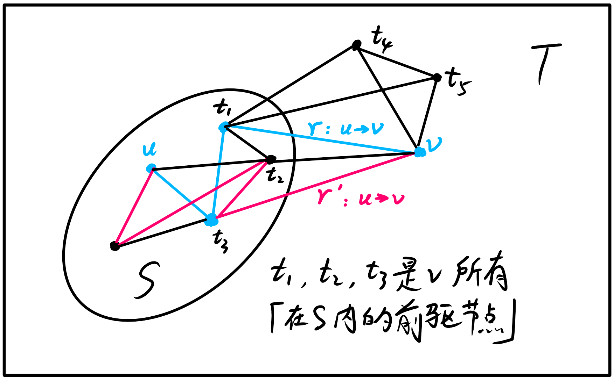
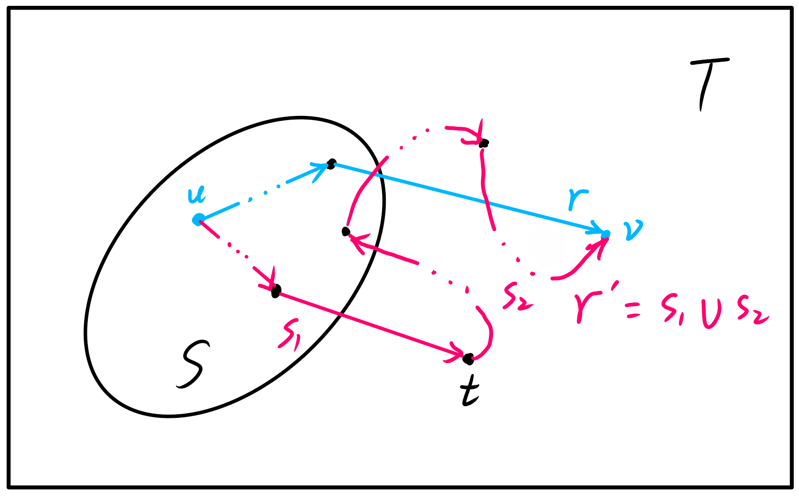

Dijkstra 算法的核心思想是贪心，本文讲解它正确性的数学证明．

<!-- more -->

## 问题

给定一个非负权边的图，规定起点为 $u$，求从 $u$ 出发到每一个节点的最短路径．（求解**非负权**图上**单源**最短路径）

## 流程简述

将结点分成两个集合：已确定最短路长度的点集（记为 $S$ 集合）的和未确定最短路长度的点集（记为 $T$ 集合）．

一开始所有的点都属于 $T$ 集合，$\mathrm{dis}(s) = 0$，其他点的 $\mathrm{dis}$ 均为 $+\infty$．

然后重复这些操作：

1. 从 $T$ 集合中，选取一个最短路长度最小的结点，移到 $S$ 集合中；
2. 对那些刚刚被加入 $S$ 集合的结点的所有在 $T$ 内的邻接点更新 $\mathrm{dis}$．

直到 $T$ 集合为空，算法结束．

## 正确性证明

显然，Dijkstra算法的正确性取决于命题「每当一个结点 $v$ 加入 $S$ 集合时，此时 $\mathrm{dis}(v)$ 对应的路径 $r : u \rightarrow v$ 的长必为全局最短路径长 $D(v)$」的真伪．

（反证法）**假设存在另一条路径 $r' : u \rightarrow v$ 为全局最短路径**，即
$$
D(v) < \mathrm{dis}(v)
$$
有一个非常重要的点：**$r'$ 的结点中除了终点 $v \in T$，必然存在另一点 $t \in T$**．

> 证明：（反证法）假设 $r'$ 是**只有终点 $v$ 在 $T$ 内的**路径．
>
> 根据操作2，**此时 $\mathrm{dis}(v)$ 已经被 $v$ 的所有在 $S$ 内的前驱结点更新（不单只是 $v$，$T$ 内所有的结点也被所有相应的前驱结点更新）**，对应的路径 $r$ 已经是所有**只有终点 $v$ 在 $T$ 内的**路径 $u \rightarrow v$ 中**最短**的一条路径，因此不存在另一条只有终点 $v$ 在 $T$ 内的路径 $r'$，使得 $r'$ 的路径长 $|r'|$ 比 $r$ 的路径长 $|r|$ 短，与假设矛盾．
>
> 故 $r'$ 的结点中除了终点 $v \in T$，必然存在另一点 $t \in T$．
>
> 

因此不妨设路径$r'$中**第一个**在$T$内的结点为$t$．

对于从 $T$ 中**通过Dijkstra算法选出来的**结点 $v$，有另一个非常重要的点：**所有在 $T$ 内的结点中，$\mathrm{dis}(v)$ 最小**．因此
$$
\mathrm{dis}(t) \ge \mathrm{dis}(v)
$$
**在全局最短路径 $r'$ 中**，设局部路径
$$
s_1:u \rightarrow t \qquad s_2:t \rightarrow v
$$
根据操作2，**此时 $\mathrm{dis} (t)$ 已经被 $t$ 的所有在 $S$ 内的前驱结点更新**，因此 $\mathrm{dis} (t)$ 对应的路径已经是**只有终点 $t$ 在 $T$ 内的最短路径**．因为 $s_1 \sube r'$，所以 $s_1$ 必为 $u \rightarrow t$ 的**全局**最短路径，又因为 $s_1$ 是只有终点 $t$ 在 $T$ 内的路径，故 $s_1$ 也为**只有终点 $t$ 在 $T$ 内的最短路径**，因此有
$$
D(t) = \mathrm{dis} (t)
$$
**在非负权图中**，有
$$
|s_2| \ge 0
$$
根据假设（路径 $r': u \rightarrow t \rightarrow v$ 为全局最短路径），有
$$
D(v) = D(t) + |s_2| = \mathrm{dis}(t) + |s_2| \ge \mathrm{dis}(t) \ge \mathrm{dis}(v) > D(v)
$$
这显然不成立，原命题得证．
