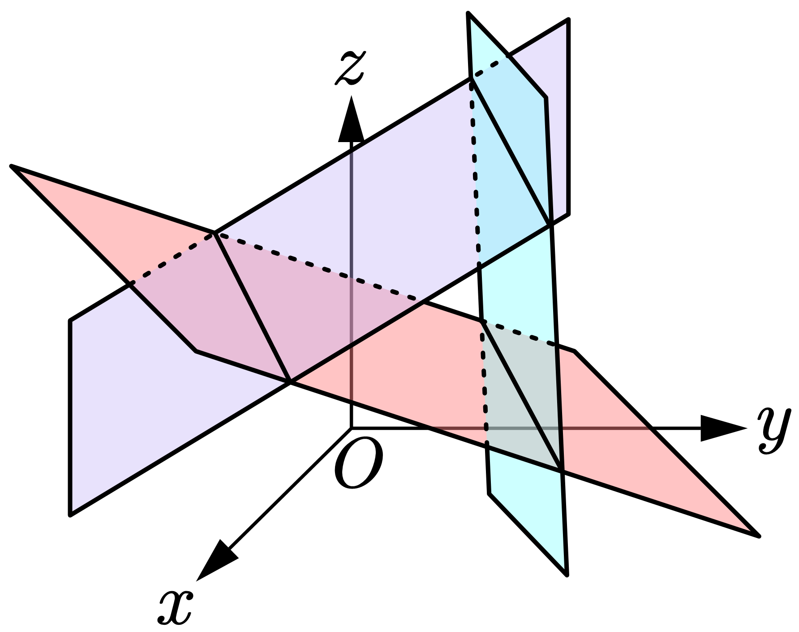
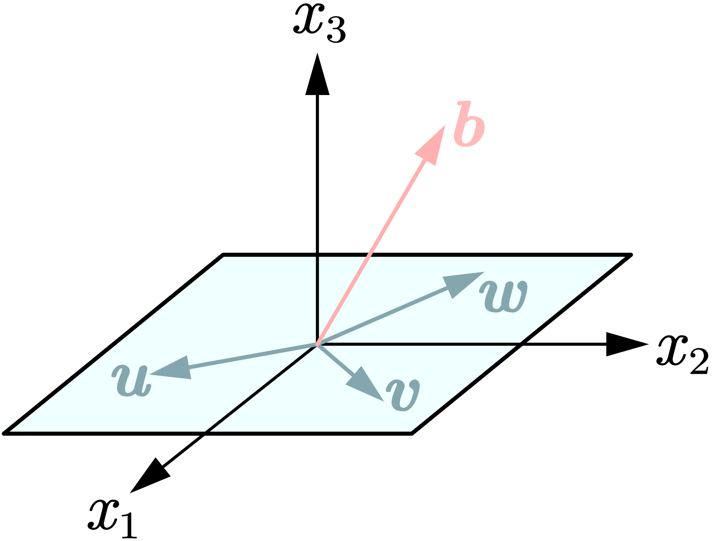
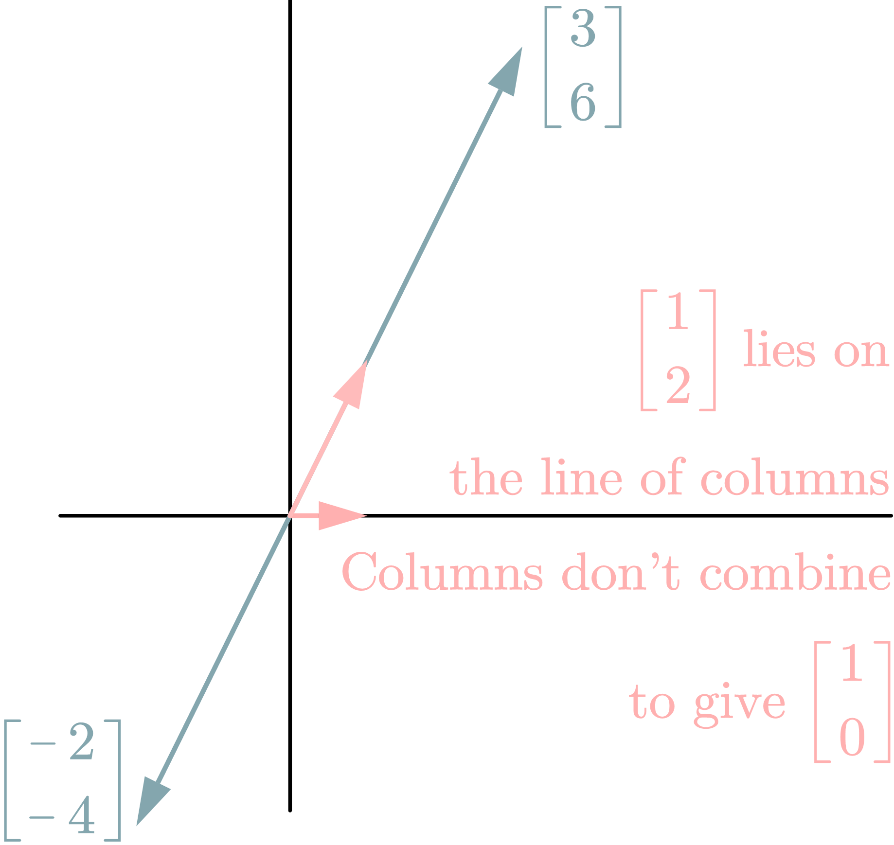

## Problem Set 2.1

1. *Find the two components of $A \boldsymbol{x}$ by rows or by columns:*

   $$
     \begin{bmatrix}2 & 3 \\ 5 & 1\end{bmatrix}\begin{bmatrix}4 \\ 2\end{bmatrix} \quad \text{and} \quad \begin{bmatrix}3 & 6 \\ 6 & 12\end{bmatrix} \begin{bmatrix} 2 \\ -1\end{bmatrix} \quad \text{and} \quad \begin{bmatrix}1 & 2 & 4 \\ 2 & 0 & 1\end{bmatrix}\begin{bmatrix}3 \\ 1 \\ 1\end{bmatrix}.
   $$

> **Solution**
>
> $\begin{bmatrix*}2 & 3 \\ 5 & 1\end{bmatrix*}\begin{bmatrix*}4 \\ 2\end{bmatrix*} = \begin{bmatrix*} 2 \cdot 4 + 3 \cdot 2 \\ 5 \cdot 4 + 1 \cdot 2\end{bmatrix*} = \begin{bmatrix*}14 \\ 22\end{bmatrix*}$
>
> $\begin{bmatrix*}3 & 6 \\ 6 & 12\end{bmatrix*}\begin{bmatrix*}2 \\ -1\end{bmatrix*} = \begin{bmatrix*} 3 \cdot 2 + 6 \cdot (-1) \\ 6 \cdot 2 + 12 \cdot (-1)\end{bmatrix*} = \begin{bmatrix*}0 \\ 0\end{bmatrix*}$
>
> $\begin{bmatrix}1 & 2 & 4 \\ 2 & 0 & 1\end{bmatrix}\begin{bmatrix}3 \\ 1 \\ 1\end{bmatrix} = \begin{bmatrix*}1 \cdot 3 + 2 \cdot 1 + 4 \cdot 1 \\ 2 \cdot 3 + 0 \cdot 1 + 1 \cdot 1\end{bmatrix*} = \begin{bmatrix*}9 \\ 7\end{bmatrix*}$

2. *(a) What 2 by 2 matrix $R$ rotates every vector by 90°? $R$ times $\begin{bmatrix}x \\ y\end{bmatrix}$ is $\begin{bmatrix}y \\ -x\end{bmatrix}$.*

 *(b) What 2 by 2 matrix $R^2$ rotates every vector by 180°?*

 > **Solution**
 > (a) Note that
 > $$
 > \begin{bmatrix*}0 & 1 \\ -1 & 0\end{bmatrix*}\begin{bmatrix*}x \\ y\end{bmatrix*} = \begin{bmatrix*}y \\ -x\end{bmatrix*}
 > $$
 > so we get $R = \begin{bmatrix*}0 & 1 \\ -1 & 0\end{bmatrix*}$.
 >
 > (b) For every vector $\begin{bmatrix*}x \\ y\end{bmatrix*}$, we note that it will become vector $\begin{bmatrix*}-x \\ -y\end{bmatrix*}$ after rotating 180°. Since
 > $$
 > \begin{bmatrix*}[r]-1 & 0 \\ 0 & -1\end{bmatrix*}\begin{bmatrix*}x \\ y\end{bmatrix*} = \begin{bmatrix*}-x \\ -y\end{bmatrix*}
 > $$
 > we get $R^2 = \begin{bmatrix*}[r]-1 & 0 \\ 0 & -1\end{bmatrix*}$.

3. Suppose $\boldsymbol{u}$ and $\boldsymbol{v}$ are the first two columns of a 3 by 3 matrix $A$. Which third columns $\boldsymbol{w}$ would make this matrix singular? Describe a typical column picture of $A \boldsymbol{x} = \boldsymbol{b}$ in that singular case, and a typical row picture (for a random $\boldsymbol{b}$).

> **Solution**
> $A$ is singular as long as $\boldsymbol{w}$ is a linear combination of $\boldsymbol{u}$ and $\boldsymbol{v}$, because in this case $\boldsymbol{u}$, $\boldsymbol{v}$, and $\boldsymbol{w}$ are dependent.

|   The Row Picture of $A$    |  The Column Picture of $A$  |
| :-------------------------: | :-------------------------: |
|  |  |

## Problem Set 2.2

1. *What test on $b_1$ and $b_2$ decides whether these two equations allow a solution? How many solutions will they have? Draw the column picture for $\boldsymbol{b} = (1, 2)$ and $(1, 0)$.*

   $$
   \begin{aligned}
     3x - 2y &= b_1 \\
     6x - 4y &= b_2
   \end{aligned}
   $$

> **Solution**
> Note that the second equation can be transformed into $3x - 2y = \frac{1}{2}b_2$, which is also equal to $b_1$. So these two equations allow infinitely many solutions when $2b_1 = b_2$, and allow no solution when $2b_1 \ne b_2$.
>
> 

2. *Elimination in the usual order gives what matrix $U$ and what solution to this "lower triangular" system? We are really solving by forward substitution:*

   $$
   \begin{aligned}
    &3x &= 3 \\
    &6x + 2y &= 8 \\
    &9x - 2y + z &= 9
   \end{aligned}
   $$

> **Solution**
> $\begin{bmatrix*}A & \boldsymbol{b}\end{bmatrix*} = \begin{bmatrix*}3 & 0 & 0 & 3 \\ 6 & 2 & 0 & 8 \\ 9 & -2 & 1 & 9\end{bmatrix*} \rightarrow \begin{bmatrix*}3 & 0 & 0 & 3 \\ 0 & 2 & 0 & 2 \\ 0 & -2 & 1 & 0\end{bmatrix*} \rightarrow \begin{bmatrix*}3 & 0 & 0 & 3 \\ 0 & 2 & 0 & 2 \\ 0 & 0 & 1 & 2\end{bmatrix*} = \begin{bmatrix*}U & \boldsymbol{c}\end{bmatrix*}$.
>
> So $U = \begin{bmatrix*}3 & 0 & 0 \\ 0 & 2 & 0 \\ 0 & 0 & 1\end{bmatrix*}$, $\boldsymbol{c} = \begin{bmatrix*}3 \\ 2 \\ 2\end{bmatrix*}$. That means
> $$
> \left\{\begin{align*}3x &= 3 \\ 2y &= 2 \\ z &= 2\end{align*}\right.
> $$
> We get
> $$
> \begin{cases}
> x = 1 \\
> y = 1 \\
> z = 2
> \end{cases}
> $$

## Problem Set 2.3

1. *Which three matrices $E_{21}$, $E_{31}$, $E_{32}$ put $A$ into triangular form $U$? Multiply those $E$'s to get one matrix $M$ that does elimination: $MA=U$.*

   $$
   A=\begin{bmatrix}1 & 1 & 0 \\ 4 & 6 & 1 \\ -2 & 2 & 0\end{bmatrix} \quad \text{and} \quad E_{32}E_{31}E_{21}A=U
   $$

> **Solution**
> To eliminate $a_{21}$, $A$ need a multiplier $\ell_{21} = a_{21}/a_{11} = 4$ to do subtraction, then $E_{21} = \begin{bmatrix*}1 & 0 & 0 \\ -4 & 1 & 0 \\ 0 & 0 & 1\end{bmatrix*}$.
>
> To eliminate $a_{31}$, $A$ need a multiplier $\ell_{31} = a_{31}/a_{11} = -2$ to do subtraction, then $E_{31} = \begin{bmatrix*}1 & 0 & 0 \\ 0 & 1 & 0 \\ 2 & 0 & 1\end{bmatrix*}$.
>
> To eliminate $a_{32}$,  $\ell_{32} = a_{32}/a_{22} = 1/3$, then $E_{21} = \begin{bmatrix*}1 & 0 & 0 \\ 0 & 1 & 0 \\ 0 & -1/3 & 1\end{bmatrix*}$.
>
> We get $M = E_{32}E_{31}E_{21} = \begin{bmatrix*}1 & 0 & 0 \\ -4 & 1 & 0 \\ 2 & -1/3 & 1\end{bmatrix*}$.

2. *Multiply these matrices:*
   $$
   \begin{bmatrix}0&0&1\\0&1&0\\1&0&0\end{bmatrix}\begin{bmatrix}1&2&3\\4&5&6\\7&8&9\end{bmatrix}\begin{bmatrix}0&0&1\\0&1&0\\1&0&0\end{bmatrix} \qquad \qquad \begin{bmatrix}1&0&0\\-1&1&0\\-1&0&1\end{bmatrix}\begin{bmatrix}1&2&3\\1&3&1\\1&4&0\end{bmatrix}
   $$

> **Solution**
> The first matrix
> $$
> \begin{aligned}\begin{bmatrix}0&0&1\\0&1&0\\1&0&0\end{bmatrix}\begin{bmatrix}1&2&3\\4&5&6\\7&8&9\end{bmatrix}\begin{bmatrix}0&0&1\\0&1&0\\1&0&0\end{bmatrix} &= \left(\begin{bmatrix}0&0&1\\0&1&0\\1&0&0\end{bmatrix}\begin{bmatrix}1&2&3\\4&5&6\\7&8&9\end{bmatrix}\right) \begin{bmatrix}0&0&1\\0&1&0\\1&0&0\end{bmatrix} \\\\ &= \begin{bmatrix}7 & 8 & 9 \\ 4 & 5 & 6 \\ 1 & 2 & 3\end{bmatrix}\begin{bmatrix}0&0&1\\0&1&0\\1&0&0\end{bmatrix} \\\\ &= \begin{bmatrix} 9 & 8 & 7 \\ 6 & 5 & 4 \\ 3 & 2 & 1 \end{bmatrix}\end{aligned}
> $$
> The second matrix
> $$
>  \begin{bmatrix}1&0&0\\-1&1&0\\-1&0&1\end{bmatrix}\begin{bmatrix}1&2&3\\1&3&1\\1&4&0\end{bmatrix} = \begin{bmatrix}1 & 2 & 3 \\ 0 & 1 & -2 \\ 0 & 2 & -3\end{bmatrix}
> $$
>

3. If $AB = I$ and $BC = I$ use the associative law to prove $A = C$.

> **Proof**
> $$
> A = AI = A(BC) = (AB)C = IC = C
> $$
