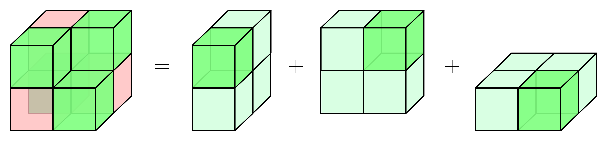
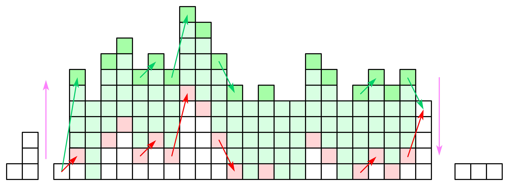
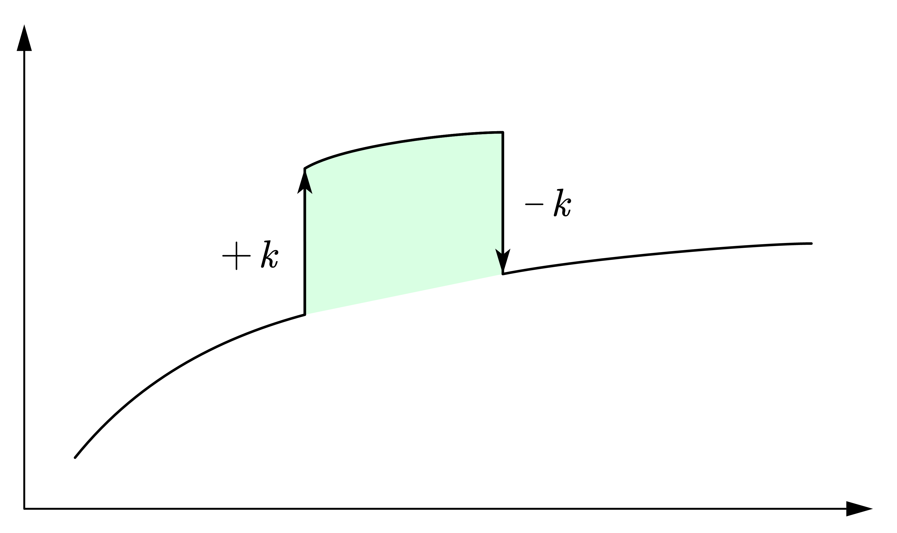
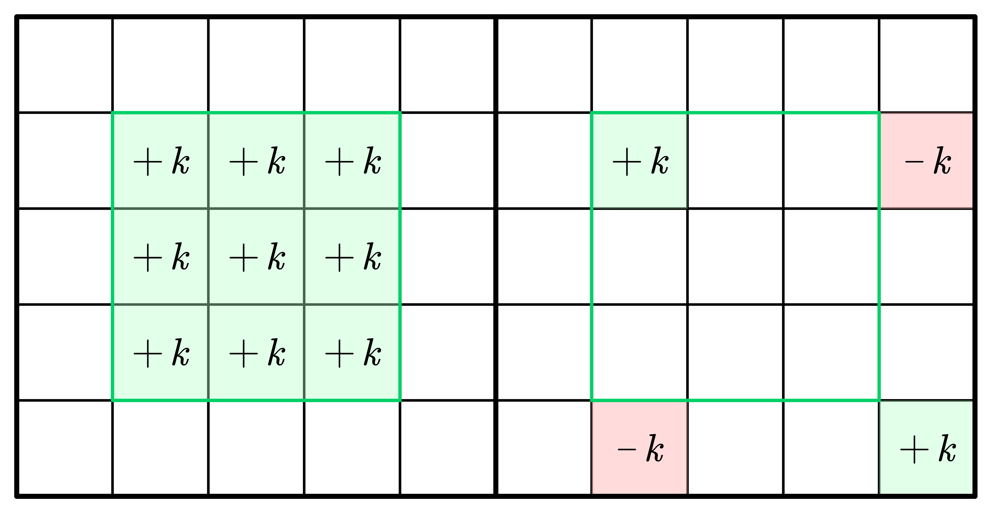

## 差分

### 性质

我们定义**差分是前缀和的逆运算**。例如一维数组的前缀和
$$
S_n = a_n + S_{n-1}
$$
作替换 $S_n \rightarrow a_n$，$a_n \rightarrow d_n$，那么一维数组的差分
$$
d_n = a_n - a_{n-1}
$$
同理，根据容斥原理，二维数组的前缀和
$$
S_{i, j} = a_{i, j} + S_{i-1, j} + S_{i, j-1} - S_{i-1, j-1}
$$
作替换后得二维数组的差分
$$
d_{i, j} = a_{i, j} - a_{i-1, j} - a_{i, j-1} + a_{i-1, j-1}
$$
规定差分数组的首项为原数组的首项。

> 拓展：根据容斥原理，三位数组前缀和如下图
>
> 

根据定义，我们有一个重要性质：**差分的前缀和是原数组**，这跟导数与积分的关系如出一辙。

差分用于**区间修改后单点查询**，为什么？两张图就能解释清楚：





图中的区间运算就是给区间 $[l, r]$ 内的所有数加上 $k$，反映在差分数组上，就是在左闭右开区间的首尾 $l$ 和 $r+1$ 处，一个加 $k$，一个减 $k$（$k$ 可为负数），此时**对差分数组求前缀和即可变回原数组**。相比以 $O(n)$ 的时间批量运算，**仅在首尾处进行运算和逆运算**的时间复杂度降到了 $O(1)$。类似地，二维差分中，“左上闭右下开”区域 $(x_1, y_1), (x_2, y_2)$ 的“首尾”是四个点：左上 $(x_1, y_1)$，左下 $(x_2 + 1, y_1)$，右上 $(x_1, y_2 + 1)$，右下 $(x_2 + 1, y_2 + 1)$。



> 注意：如果 $r+1$ 越界，此时运算反映在原数组上就是对 $[l, n]$ 整体加 $k$，反映在差分数组上就是单独对 $d_l$ 加 $k$。因此**区间操作反映在差分数组上仅有两种形式**：任选两个位置加 $k$ 减 $k$；任选一个位置单独加 $k$。

**适用于前缀和的运算同样也适用于差分**，例如异或，模意义下的乘法等。

当然，运算并不局限于加减常数，只要是 $k$ 次**多项式的批量加减**，都可以进行 $k+1$ 次差分后优化到 $O(1)$ 的首尾操作。

> 以等差数列的形式对数组进行区间加法运算，例如对数组 $a$ 的区间 $[10, 13]$ 上的每个元素依次加 $1, 3, 5, 7$，对数组一次差分后得到 $\Delta a$，此时运算就转化成对数组 $\Delta a$ 的区间 $[10, 14]$ 上的每个元素依次加上 $1, 2, 2, 2, -7$（这里末项就是前面所有项和的相反数，以回归未操作区域的差分值），再次差分得到 $\Delta^2 a$，此时运算就转化成对数组 $\Delta^2 a$ 的区间 $[10, 15]$ 上的每个元素依次加 $1, 1, 0, 0, -9, 7$。

> 对二维数组进行有规律的加法：
>
> |      |      |      |      |      |      |      |      |      |      |      |
> | ---- | ---- | ---- | ---- | ---- | ---- | ---- | ---- | ---- | ---- | ---- |
> |      |      |      |      | +1   |      |      |      |      |      |      |
> |      |      |      | +1   | +4   | +1   |      |      |      |      |      |
> |      |      | +1   | +4   | +9   | +4   | +1   |      |      |      |      |
> |      | +1   | +4   | +9   | +16  | +9   | +4   | +1   |      |      |      |
> |      |      | +1   | +4   | +9   | +4   | +1   |      |      |      |      |
> |      |      |      | +1   | +4   | +1   |      |      |      |      |      |
> |      |      |      |      | +1   |      |      |      |      |      |      |
> |      |      |      |      |      |      |      |      |      |      |      |
> |      |      |      |      |      |      |      |      |      |      |      |
> |      |      |      |      |      |      |      |      |      |      |      |
>
> 一次差分后：
>
> |      |      |      |      |      |      |      |      |      |      |      |
> | ---- | ---- | ---- | ---- | ---- | ---- | ---- | ---- | ---- | ---- | ---- |
> |      |      |      |      | +1   | -1   |      |      |      |      |      |
> |      |      |      | +1   | +2   | -2   | -1   |      |      |      |      |
> |      |      | +1   | +2   | +2   | -2   | -2   | -1   |      |      |      |
> |      | +1   | +2   | +2   | +2   | -2   | -2   | -2   | -1   |      |      |
> |      | -1   | -2   | -2   | -2   | +2   | +2   | +2   | +1   |      |      |
> |      |      | -1   | -2   | -2   | +2   | +2   | +1   |      |      |      |
> |      |      |      | -1   | -2   | +2   | +1   |      |      |      |      |
> |      |      |      |      | -1   | +1   |      |      |      |      |      |
> |      |      |      |      |      |      |      |      |      |      |      |
> |      |      |      |      |      |      |      |      |      |      |      |
>
> 二次差分后：
>
> |      |      |      |      |      |      |      |      |      |      |      |
> | ---- | ---- | ---- | ---- | ---- | ---- | ---- | ---- | ---- | ---- | ---- |
> |      |      |      |      | +1   | -2   | +1   |      |      |      |      |
> |      |      |      | +1   |      | -2   |      | +1   |      |      |      |
> |      |      | +1   |      | -1   |      | -1   |      | +1   |      |      |
> |      | +1   |      | -1   |      |      |      | -1   |      | +1   |      |
> |      | -2   | -2   |      |      | +8   |      |      | -2   | -2   |      |
> |      | +1   |      | -1   |      |      |      | -1   |      | +1   |      |
> |      |      | +1   |      | -1   |      | -1   |      | +1   |      |      |
> |      |      |      | +1   |      | -2   |      | +1   |      |      |      |
> |      |      |      |      | +1   | -2   | +1   |      |      |      |      |
> |      |      |      |      |      |      |      |      |      |      |      |
>
> 三次差分后却更乱了：
>
> |      |      |      |      |      |      |      |      |      |      |      |
> | ---- | ---- | ---- | ---- | ---- | ---- | ---- | ---- | ---- | ---- | ---- |
> |      |      |      |      | +1   | -3   | +3   | -1   |      |      |      |
> |      |      |      | +1   | -2   | +1   | -1   | +2   | -1   |      |      |
> |      |      | ...  |      |      |      |      |      |      | ...  |      |
> |      | ...  |      |      |      |      |      |      |      |      | ...  |
> |      | ...  |      |      |      | +8   | -8   |      |      |      | ...  |
> |      | ...  |      |      |      | -8   | +8   |      |      |      | ...  |
> |      | ...  |      |      |      |      |      |      |      |      | ...  |
> |      |      | ...  |      |      |      |      |      |      | ...  |      |
> |      |      |      | ...  |      |      |      |      | ...  |      |      |
> |      |      |      |      | ...  | ...  | ...  | ...  |      |      |      |
>
> 并不是每次差分都能带来完美效果的，一般涉及区域修改时，常截取某次差分的结果使用。差分方式也不是死板的，也可以先二维差分，然后沿对角线差分之类的。

差分另一方面的用途是：**差分的正负性反映了原数组的单调性**。

### 代码

```cpp
auto diff = vector(n + 1, vector<int>(m + 1));
for (int i = 1; i <= n; i++) {
  for (int j = 1; j <= m; j++) {
    // i = n + 1, j = m + 1 类似的越界处的差分不用关心
    diff[i][j] = a[i][j] - a[i][j-1] - a[i-1][j] + a[i-1][j-1];
  }
}
```
