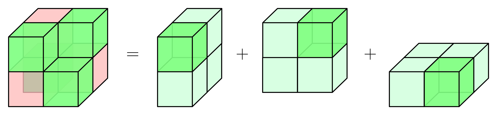
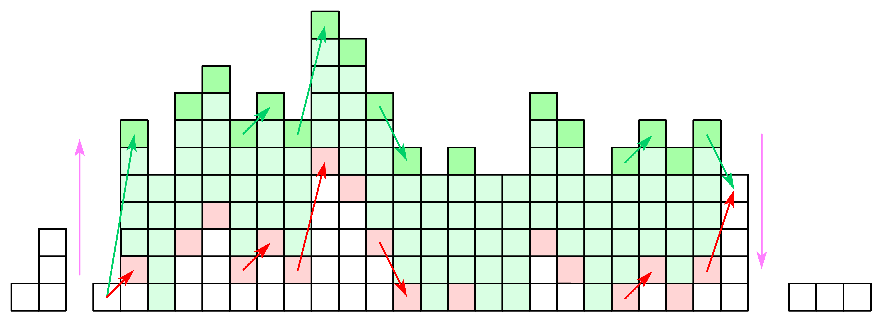
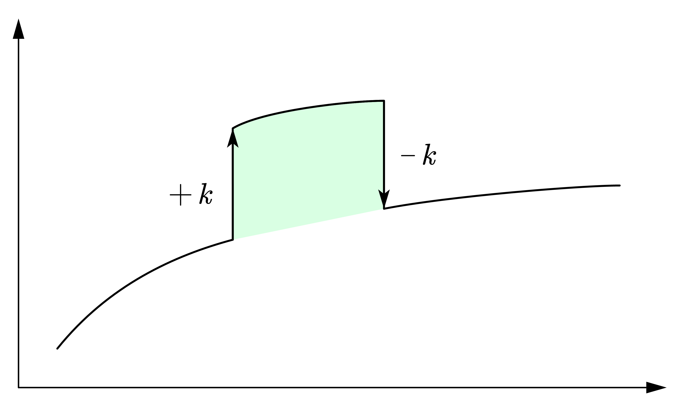
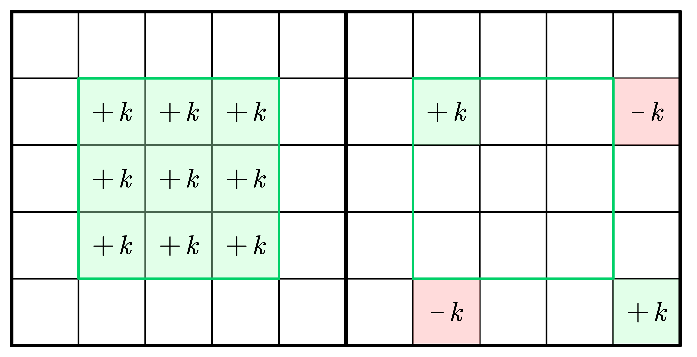

区间修改后单点查询非常适合使用差分处理，本文主要介绍差分的基本原理以及简单应用，讲解到三维差分和多重差分．

<!-- more -->

## 性质

我们定义**差分是前缀和的逆运算**．例如一维数组的前缀和
$$
S_n = a_n + S_{n-1}
$$
作替换 $S_n \rightarrow a_n$，$a_n \rightarrow d_n$，那么一维数组的差分
$$
d_n = a_n - a_{n-1}
$$
同理，根据容斥原理，二维数组的前缀和
$$
S_{i, j} = a_{i, j} + S_{i-1, j} + S_{i, j-1} - S_{i-1, j-1}
$$
作替换后得二维数组的差分
$$
d_{i, j} = a_{i, j} - a_{i-1, j} - a_{i, j-1} + a_{i-1, j-1}
$$
规定差分数组的首项为原数组的首项．

> 拓展：根据容斥原理，三位数组前缀和如下图
>
> 

根据定义，我们有一个重要性质：**差分的前缀和是原数组**，这跟导数与积分的关系如出一辙．

差分用于**区间修改后单点查询**，为什么？两张图就能解释清楚：





图中的区间运算就是给区间 $[l, r]$ 内的所有数加上 $k$，反映在差分数组上，就是在左闭右开区间的首尾 $l$ 和 $r+1$ 处，一个加 $k$，一个减 $k$（$k$ 可为负数），此时**对差分数组求前缀和即可变回原数组**．相比以 $O(n)$ 的时间批量运算，**仅在首尾处进行运算和逆运算**的时间复杂度降到了 $O(1)$．类似地，二维差分中，“左上闭右下开”区域 $(x_1, y_1), (x_2, y_2)$ 的“首尾”是四个点：左上 $(x_1, y_1)$，左下 $(x_2 + 1, y_1)$，右上 $(x_1, y_2 + 1)$，右下 $(x_2 + 1, y_2 + 1)$．



> 注意：如果 $r+1$ 越界，此时运算反映在原数组上就是对 $[l, n]$ 整体加 $k$，反映在差分数组上就是单独对 $d_l$ 加 $k$．因此**区间操作反映在差分数组上仅有两种形式**：任选两个位置加 $k$ 减 $k$；任选一个位置单独加 $k$．

**适用于前缀和的运算同样也适用于差分**，例如异或，模意义下的乘法等．

当然，运算并不局限于加减常数，只要是 $k$ 次**多项式的批量加减**，都可以进行 $k+1$ 次差分后优化到 $O(1)$ 的首尾操作．

> 以等差数列的形式对数组进行区间加法运算，例如对数组 $a$ 的区间 $[10, 13]$ 上的每个元素依次加 $1, 3, 5, 7$，对数组一次差分后得到 $\Delta a$，此时运算就转化成对数组 $\Delta a$ 的区间 $[10, 14]$ 上的每个元素依次加上 $1, 2, 2, 2, -7$（这里末项就是前面所有项和的相反数，以回归未操作区域的差分值），再次差分得到 $\Delta^2 a$，此时运算就转化成对数组 $\Delta^2 a$ 的区间 $[10, 15]$ 上的每个元素依次加 $1, 1, 0, 0, -9, 7$．
>
> 对二维数组进行有规律的加法：
>
> |      |      |      |      |      |      |      |      |      |      |      |
> | ---- | ---- | ---- | ---- | ---- | ---- | ---- | ---- | ---- | ---- | ---- |
> |      |      |      |      | +1   |      |      |      |      |      |      |
> |      |      |      | +1   | +4   | +1   |      |      |      |      |      |
> |      |      | +1   | +4   | +9   | +4   | +1   |      |      |      |      |
> |      | +1   | +4   | +9   | +16  | +9   | +4   | +1   |      |      |      |
> |      |      | +1   | +4   | +9   | +4   | +1   |      |      |      |      |
> |      |      |      | +1   | +4   | +1   |      |      |      |      |      |
> |      |      |      |      | +1   |      |      |      |      |      |      |
> |      |      |      |      |      |      |      |      |      |      |      |
> |      |      |      |      |      |      |      |      |      |      |      |
> |      |      |      |      |      |      |      |      |      |      |      |
>
> 一次差分后：
>
> |      |      |      |      |      |      |      |      |      |      |      |
> | ---- | ---- | ---- | ---- | ---- | ---- | ---- | ---- | ---- | ---- | ---- |
> |      |      |      |      | +1   | -1   |      |      |      |      |      |
> |      |      |      | +1   | +2   | -2   | -1   |      |      |      |      |
> |      |      | +1   | +2   | +2   | -2   | -2   | -1   |      |      |      |
> |      | +1   | +2   | +2   | +2   | -2   | -2   | -2   | -1   |      |      |
> |      | -1   | -2   | -2   | -2   | +2   | +2   | +2   | +1   |      |      |
> |      |      | -1   | -2   | -2   | +2   | +2   | +1   |      |      |      |
> |      |      |      | -1   | -2   | +2   | +1   |      |      |      |      |
> |      |      |      |      | -1   | +1   |      |      |      |      |      |
> |      |      |      |      |      |      |      |      |      |      |      |
> |      |      |      |      |      |      |      |      |      |      |      |
>
> 二次差分后：
>
> |      |      |      |      |      |      |      |      |      |      |      |
> | ---- | ---- | ---- | ---- | ---- | ---- | ---- | ---- | ---- | ---- | ---- |
> |      |      |      |      | +1   | -2   | +1   |      |      |      |      |
> |      |      |      | +1   |      | -2   |      | +1   |      |      |      |
> |      |      | +1   |      | -1   |      | -1   |      | +1   |      |      |
> |      | +1   |      | -1   |      |      |      | -1   |      | +1   |      |
> |      | -2   | -2   |      |      | +8   |      |      | -2   | -2   |      |
> |      | +1   |      | -1   |      |      |      | -1   |      | +1   |      |
> |      |      | +1   |      | -1   |      | -1   |      | +1   |      |      |
> |      |      |      | +1   |      | -2   |      | +1   |      |      |      |
> |      |      |      |      | +1   | -2   | +1   |      |      |      |      |
> |      |      |      |      |      |      |      |      |      |      |      |
>
> 三次差分后却更乱了：
>
> |      |      |      |      |      |      |      |      |      |      |      |
> | ---- | ---- | ---- | ---- | ---- | ---- | ---- | ---- | ---- | ---- | ---- |
> |      |      |      |      | +1   | -3   | +3   | -1   |      |      |      |
> |      |      |      | +1   | -2   | +1   | -1   | +2   | -1   |      |      |
> |      |      | ...  |      |      |      |      |      |      | ...  |      |
> |      | ...  |      |      |      |      |      |      |      |      | ...  |
> |      | ...  |      |      |      | +8   | -8   |      |      |      | ...  |
> |      | ...  |      |      |      | -8   | +8   |      |      |      | ...  |
> |      | ...  |      |      |      |      |      |      |      |      | ...  |
> |      |      | ...  |      |      |      |      |      |      | ...  |      |
> |      |      |      | ...  |      |      |      |      | ...  |      |      |
> |      |      |      |      | ...  | ...  | ...  | ...  |      |      |      |
>
> 并不是每次差分都能带来完美效果的，一般涉及区域修改时，常截取某次差分的结果使用．差分方式也不是死板的，也可以先二维差分，然后沿对角线差分之类的．

差分另一方面的用途是：**差分的正负性反映了原数组的单调性**．

## 代码

### 二维差分

```cpp
auto diff = vector(n + 1, vector<int>(m + 1));
for (int i = 1; i <= n; i++) {
  for (int j = 1; j <= m; j++) {
    // i = n + 1, j = m + 1 类似的越界处的差分不用关心
    diff[i][j] = a[i][j] - a[i][j-1] - a[i-1][j] + a[i-1][j-1];
  }
}
```

### 三维差分

> [蓝桥杯 2018 省 A] 三体攻击
>
> 题目描述
>
> 三体人将对地球发起攻击．为了抵御攻击，地球人派出了 $A\times B\times C$ 艘战舰，在太空中排成一个 $A$ 层 $B$ 行 $C$ 列的立方体．其中，第 $i$ 层第 $j$ 行第 $k$ 列的战舰（记为战舰 $(i, j, k)$）的生命值为 $d(i, j, k)$．
>
> 三体人将会对地球发起 $m$ 轮“立方体攻击”，每次攻击会对一个小立方体中的所有战舰都造成相同的伤害．具体地，第 $t$ 轮攻击用 $7$ 个参数 $la_t, ra_t, lb_t, rb_t, lc_t, rc_t, h_t$ 描述；
>
> 所有满足 $i\in [la_t, ra_t],j\in [lb_t, rb_t],k\in [lc_t, rc_t]$ 的战舰 $(i, j, k)$ 会受到 $h_t$ 的伤害．如果一个战舰累计受到的总伤害超过其防御力，那么这个战舰会爆炸．
>
> 地球指挥官希望你能告诉他，第一艘爆炸的战舰是在哪一轮攻击后爆炸的．
>
> 输入格式
>
> 从标准输入读入数据．
>
> 第一行包括 $4$ 个正整数 $A$，$B$，$C$，$m$；
>
> 第二行包含 $A\times B\times C$ 个整数，其中第 $((i − 1)\times B + (j − 1)) \times C + (k − 1)+1$ 个数为 $d(i, j, k)$；
>
> 第 $3$ 到第 $m + 2$ 行中，第 $(t + 2)$ 行包含 $7$ 个正整数 $la_t, ra_t, lb_t, rb_t, lc_t, rc_t, h_t$．
>
> 输出格式
>
> 输出到标准输出．
>
> 输出第一个爆炸的战舰是在哪一轮攻击后爆炸的．保证一定存在这样的战舰．
>
> 输入输出样例 #1
>
> 输入 #1
>
> ```txt
> 2 2 2 3
> 1 1 1 1 1 1 1 1
> 1 2 1 2 1 1 1
> 1 1 1 2 1 2 1
> 1 1 1 1 1 1 2
> ```
>
> 输出 #1
>
> ```txt
> 2
> ```
>
> 说明/提示
>
> **【样例解释】**
>
> 在第 $2$ 轮攻击后，战舰 $(1,1,1)$ 总共受到了 $2$ 点伤害，超出其防御力导致爆炸．
>
> **【数据约定】**
>
> 对于 $10\%$ 的数据，$B = C = 1$；
>
> 对于 $20\%$ 的数据，$C = 1$；
>
> 对于 $40\%$ 的数据，$A\times B \times C, m\le10000$；
>
> 对于 $70\%$ 的数据，$A, B, C \le 200$；
>
> 对于所有数据，$1\le A\times B\times C \le 10^6$，$1\le m \le 10^6$，$0 \le (i, j, k)$, $h_t\le 10^9$．

```cpp
#include <bits/stdc++.h>
#define int long long
#define endl '\n'
using namespace std;

using coord = array<int, 3>;
using field = pair<coord, coord>;
using atk = pair<field, int>;

void solve() {
  int A, B, C, M;
  cin >> A >> B >> C >> M;
  // 压维
  auto zip = [&](int i, int j, int k) -> int { return (i * B + j) * C + k; };
  auto unzip = [&](int zrd) -> coord { return (coord){zrd / C / B, zrd / C % B, zrd % C}; };
  auto hp = vector<int>((A + 2) * (B + 2) * (C + 2));
  for (int i = 1; i <= A; i++) for (int j = 1; j <= B; j++) for (int k = 1; k <= C; k++) cin >> hp[zip(i, j, k)];
  auto atks = vector<atk>(M);
  for (auto &t : atks) {
    auto &[f, h] = t;
    auto &[p1, p2] = f;
    auto &[x1, y1, z1] = p1;
    auto &[x2, y2, z2] = p2;
    cin >> x1 >> x2 >> y1 >> y2 >> z1 >> z2 >> h;
  }
  auto check = [&](int m) -> bool {
    auto d = vector<int>((A + 2) * (B + 2) * (C + 2));
    for (int i = 0; i < m; i++) {
      auto &[f, h] = atks[i];
      auto &[p1, p2] = f;
      auto &[x1, y1, z1] = p1;
      auto &[x2, y2, z2] = p2;
      // 曼哈顿距离为奇数的角是减，偶数的角是加
      d[zip(x1    , y1    , z1    )] += h;
      d[zip(x2 + 1, y1    , z1    )] -= h;
      d[zip(x1    , y2 + 1, z1    )] -= h;
      d[zip(x1    , y1    , z2 + 1)] -= h;
      d[zip(x1    , y2 + 1, z2 + 1)] += h;
      d[zip(x2 + 1, y1    , z2 + 1)] += h;
      d[zip(x2 + 1, y2 + 1, z1    )] += h;
      d[zip(x2 + 1, y2 + 1, z2 + 1)] -= h;
    }
    // 容斥原理，前缀和
    for (int i = 1; i <= A; i++) {
      for (int j = 1; j <= B; j++) {
        for (int k = 1; k <= C; k++) {
          d[zip(i, j, k)] += d[zip(i - 1, j, k)] + d[zip(i, j - 1, k)] + d[zip(i, j, k - 1)];
          d[zip(i, j, k)] -= d[zip(i, j - 1, k - 1)] + d[zip(i - 1, j, k - 1)] + d[zip(i - 1, j - 1, k)];
          d[zip(i, j, k)] += d[zip(i - 1, j - 1, k - 1)];
          if (hp[zip(i, j, k)] - d[zip(i, j, k)] < 0) return true;
        }
      }
    }
    return false;
  };
  // 二分答案（找前继）
  int L = 0, R = M - 1;
  while (L < R) {
    int mid = L + (R - L) / 2;
    if (check(mid)) R = mid;
    else L = mid + 1;
  }
  cout << R;
}

signed main() {
  ios::sync_with_stdio(false), cin.tie(nullptr), cout.tie(nullptr);
  solve();
}
```
